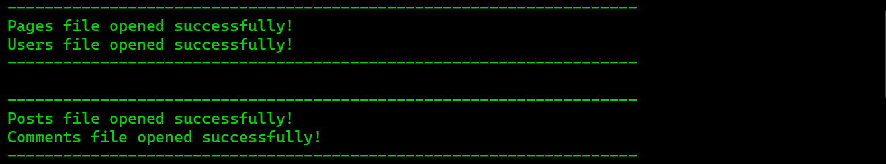
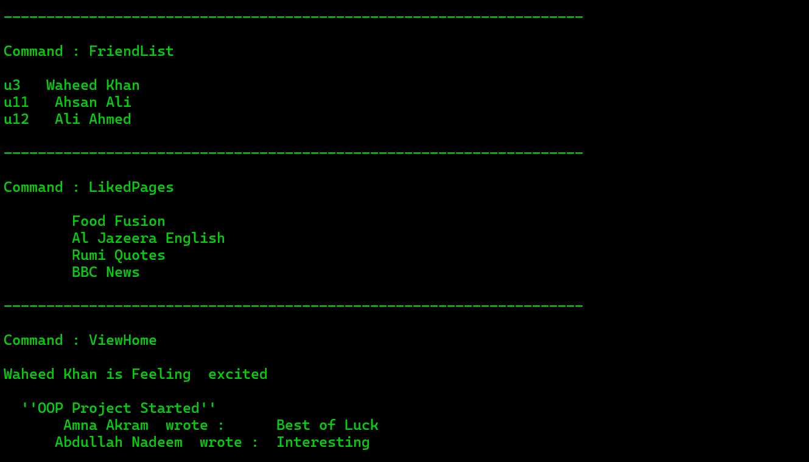
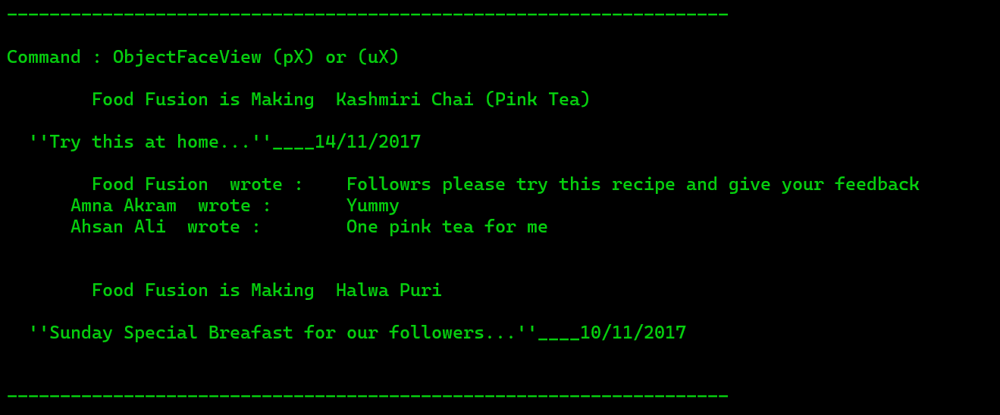
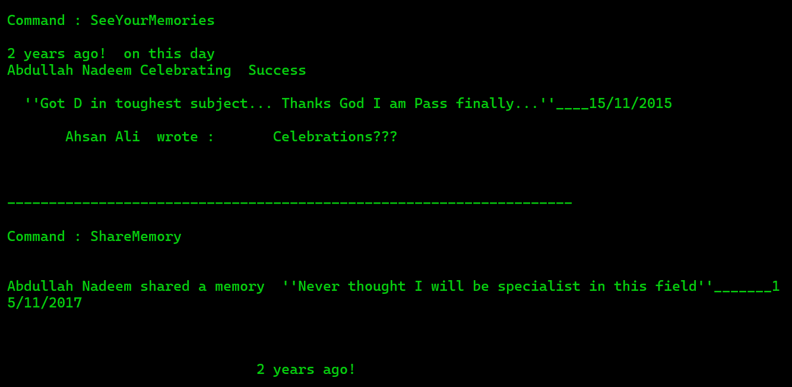
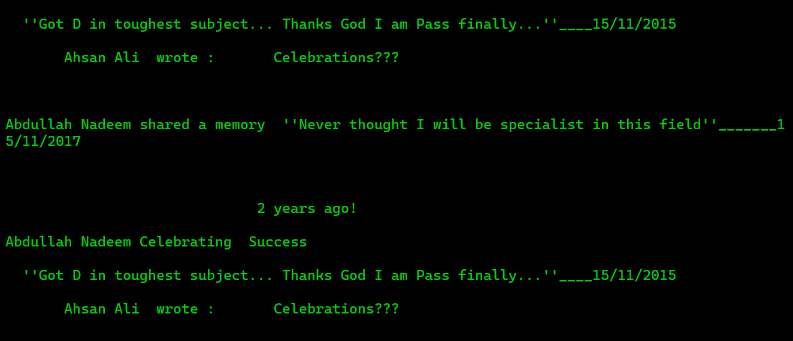

# 🕸️ Social Network Project

## 🌐 Overview

This console-based social network project is a simple implementation of a social networking system inspired by platforms like Facebook. The project is written in C++ and leverages Object-Oriented Programming (OOP) concepts such as:
- inheritance 🧬
- polymorphism 🔄
- encapsulation 🔒
- abstraction 🕵️
- aggregation 🔗
- association 🤝
- composition 🏗️

## 🚀 Features

- User Registration and Authentication 📝🔐
- Posting and Viewing Status Updates 🗨️👀
- Friend Requests and Connections 🤝🔗
- Profile Management 👤🔧
- News Feed 📰

## 📄 License

This project is licensed under the MIT License.

## 📥 Clone the Repository

```bash
git clone https://github.com/maazkhan75/Social-Network-App.git
```

## 📬 Contact
For questions or feedback, please contact maazkhan75555@gmail.com.

## 📸 Screenshots











